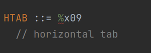

# Transformation of ABNF to BNF

Following methods are used for transformation of Augmented Backus–Naur form (.abnf) grammar into Backus–Naur form (.bnf)
.

**For your own safety and mental well-being, do not change the order in which the methods are called.**

* `replaceAllAbnfTokens(oldGrammar)`
* `deleteWhitespaces(result)`
* `rewriteNtoMMultiplier(result);`
* `rewriteDigitMultiplier(result, GrammarKitRFCUtils.MULTIPLIER_ZERO_TO_N_TIMES);`
* `rewriteDigitMultiplier(result, GrammarKitRFCUtils.MULTIPLIER_DIGIT_TIMES);`
* `rewriteDigitMultiplier(result, GrammarKitRFCUtils.MULTIPLIER_N_TIMES);`
* `trimAndAppendOperator(result, "1*", "+")`
* `trimAndAppendOperator(result, "*", "*")`
* `replaceAsterWord(result, "1*")`
* `replaceAsterWord(result, "*")`
* `replaceHexadecimalRange(result)`
* `replaceHexadecimal(result)`
* `rewriteStringRules(result)`

## YANG versions

Abnf specification for different YANG versions can be found in RFCs:

* YANG 1.0 - defined in RFC 6020
* YANG 1.1 - defined in RFC 7950

### 1. Replace tokens

Method  `replaceAllAbnfTokens(List<String> oldGrammar)` takes original .abnf grammar as a parameter. 
Except tokens enclosed inside double quotes.

* The method transforms:
    * Equal sign: `=` changed to `::=` 
    * Or: `/` changed to `|`
    * Comment: `;;` changed to `//` 
    * Comment: `;` changed to `//` 

Example of original .abnf grammar:

After transformation of equal sign, or and comment:

### 2. Delete whitespaces

Method `deleteWhitespaces(result)` removes redundant spaces:

### 3. Rewrite multiplier M-to-N

Method `rewriteNtoMMultiplier(result)` overrides **M-to-N** multiplier which specifies the minimum and maximum number
of repetition of adjacent part of the rule.

Example of M-to-N multiplier:

[//]: # (![M to N multiplier]&#40;doc-images/04_multiplier_m_n_before.png&#41;)

 

After rewriting the multiplier:

[//]: # (![Rewritten M to N multiplier]&#40;doc-images/05_multiplier_m_n_after.png&#41;)

 

### 4. Rewrite digit multiplier

Method `rewriteDigitMultiplier(final List<String> lines, Pattern typeOfToken)` is used 3 times,
always with a different `Pattern typeOfToken` argument.

#### 4.1 Rewrite digit multiplier (zero-to-N)

Multiplier **zero-to-N times** is overridden using Pattern  `MULTIPLIER_ZERO_TO_N_TIMES)`

Example of 0-to-N multiplier:

[//]: # (![M to N multiplier]&#40;doc-images/06_multiplier_zero_n_before.png&#41;)

 

After rewriting the multiplier:

[//]: # (![Rewritten M to N multiplier]&#40;doc-images/07_multiplier_zero_n_after.png&#41;)

 

#### 4.2 Rewrite digit multiplier (N times String)

Multiplier **N times** is overridden using Pattern `MULTIPLIER_N_TIMES_WORD)`

Example of multiplier:

[//]: # (![M to N multiplier]&#40;doc-images/08_multiplier_DIGIT_before.png&#41;)

 

After rewriting the multiplier:

[//]: # (![Rewritten M to N multiplier]&#40;doc-images/09_multiplier_DIGIT_after.png&#41;)

 

#### 4.3 Rewrite digit multiplier (N times Parentheses)

Multiplier **N times** is overridden using Pattern `MULTIPLIER_N_TIMES_PARENTHESES`

Example of multiplier:

[//]: # (![M to N multiplier]&#40;doc-images/10_multiplier_parentheses_before.png&#41;)

After rewriting the multiplier:

[//]: # (![Rewritten M to N multiplier]&#40;doc-images/11_multiplier_parentheses_after.png&#41;)

### 5. Replace "1*" multiplication operator

Method `trimAndAppendOperator(result,"1*","+")` removes .abnf operator `1*`
placed in front of parentheses and adds its .bnf equivalent `+` to correct position.

* Operator `1*<element>` requires at least one repetition of `<element>`.

### OLD 6. Replace "*" multiplication operator

Method `trimAndAppendOperator(result,"*","*")` removes .abnf operator `*`
placed in front of parentheses and adds its .bnf equivalent `*` to correct position.

* Operator `*<element>` allows 0 or any number of repetitions of `<element>`.

Example of original .abnf grammar:

After transformation of `*` multiplication operator:

### 7. Replace "1*" multiplication operator

Method `replaceAsterWord(result, "1*")` removes .abnf operator `1*`
placed in front of string and adds its .bnf equivalent `+` to correct position.

* Operator `1*string` requires at least one repetition of `string`.

Example of original .abnf grammar:

After transformation of `1*` multiplication operator:

### 8. Replace "*" multiplication operator

Method `replaceAsterWord(result, "*")` removes .abnf operator `*`
placed in front of a string and adds its .bnf equivalent `*` to correct position.

* Operator `*string` allows 0 or any number of repetitions of `string`.

Example of original .abnf grammar:

After transformation of `*` multiplication operator:

### 9. Replace range of hexadecimal values

Method `replaceHexadecimalRange(result)` replaces range of hexadecimal values with corresponding
string values.

Example of original .abnf grammar with range hexadecimal values:

After transformation of hexadecimal range to corresponding strings:

### 10. Replace single hexadecimal value

Method `replaceHexadecimal(result)` replaces single hexadecimal value with corresponding string value.

Example of original .abnf grammar with hexadecimal value:

After transformation of hexadecimal value to corresponding string:

### 11. Replace string rules

Method `rewriteStringRules(List<String>)` replaces commentaries enclosed in angle brackets

Example of original .abnf -str rule:

After transformation of rule:

