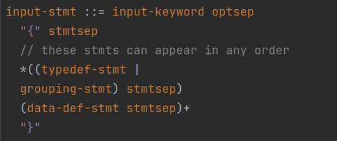

# Transformation of ABNF to BNF

Following methods are used for transformation of Augmented Backus–Naur form (.abnf) grammar into Backus–Naur form (.bnf)
.

**For your own safety and mental well-being, do not change the order in which the methods are called.**

* `replaceAllAbnfTokens(oldGrammar)`
* `deleteWhitespaces(result)`
* `trimAndAppendOperator(result, "1*", "+")`
* `trimAndAppendOperator(result, "*", "*")`
* `replaceAsterWord(result, "1*")`
* `replaceAsterWord(result, "*")`
* `replaceHexadecimalRange(result)`
* `replaceHexadecimal(result)`
* `rewriteStringRules(result)`

## YANG versions

Abnf specification for different YANG versions can be found in RFCs:

* YANG 1.0 - defined in RFC 6020
* YANG 1.1 - defined in RFC 7950

### 1. Replace tokens

Method  `replaceAllAbnfTokens(List<String> oldGrammar)` takes original .abnf grammar as a parameter. 
Except tokens enclosed inside double quotes.

* The method transforms:
    * Equal sign: `=` changed to `::=` 
    * Or: `/` changed to `|`
    * Comment: `;;` changed to `//` 
    * Comment: `;` changed to `//` 

Example of original .abnf grammar:

After transformation of equal sign, or and comment:

### 2. Delete whitespaces

Method `deleteWhitespaces(result)` removes redundant spaces:

### 3. Replace "1*" multiplication operator

Method `trimAndAppendOperator(result,"1*","+")` removes .abnf operator `1*`
placed in front of parentheses and adds its .bnf equivalent `+` to correct position.

* Operator `1*<element>` requires at least one repetition of `<element>`.

### 4. Replace "*" multiplication operator

Method `trimAndAppendOperator(result,"*","*")` removes .abnf operator `*`
placed in front of parentheses and adds its .bnf equivalent `*` to correct position.

* Operator `*<element>` allows 0 or any number of repetitions of `<element>`.

Example of original .abnf grammar:

After transformation of `*` multiplication operator:

### 5. Replace "1*" multiplication operator

Method `replaceAsterWord(result, "1*")` removes .abnf operator `1*`
placed in front of string and adds its .bnf equivalent `+` to correct position.

* Operator `1*string` requires at least one repetition of `string`.

Example of original .abnf grammar:

After transformation of `1*` multiplication operator:

### 6. Replace "*" multiplication operator

Method `replaceAsterWord(result, "*")` removes .abnf operator `*`
placed in front of a string and adds its .bnf equivalent `*` to correct position.

* Operator `*string` allows 0 or any number of repetitions of `string`.

Example of original .abnf grammar:

After transformation of `*` multiplication operator:

### 7. Replace range of hexadecimal values

Method `replaceHexadecimalRange(result)` replaces range of hexadecimal values with corresponding
string values.

Example of original .abnf grammar with range hexadecimal values:

After transformation of hexadecimal range to corresponding strings:

### 8. Replace single hexadecimal value

Method `replaceHexadecimal(result)` replaces single hexadecimal value with corresponding string value.

Example of original .abnf grammar with hexadecimal value:

After transformation of hexadecimal value to corresponding string:

### 9. Replace string rules

Method `rewriteStringRules(List<String>)` replaces commentaries enclosed in angle brackets

Example of original .abnf -str rule:

After transformation of rule:

